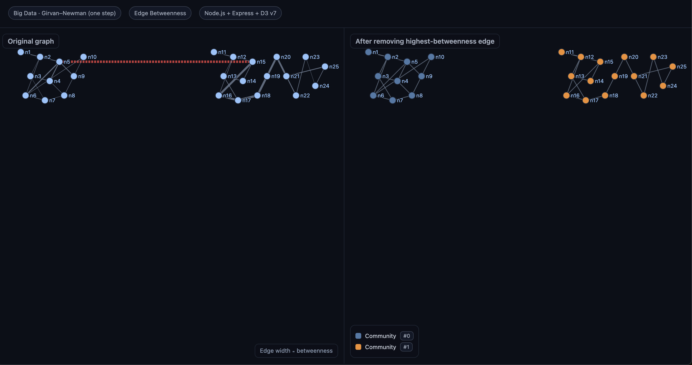

# Big Data Assignment --- Girvan--Newman Algorithm (Node.js + D3.js)

This project implements **Part A, Part B, and Part C** of your Big Data
assignment using **Node.js** (Express) and **D3.js** for visualization.

------------------------------------------------------------------------

## Overview

-   **Part A: Create an Undirected Graph**
    -   Parse `samplenetwork.txt` (20+ nodes, 25+ edges).
    -   Build an adjacency structure for graph operations.
-   **Part B: Implement Girvan--Newman Algorithm (one step)**
    1.  Compute **edge betweenness centrality** using the **Brandes
        algorithm**.
    2.  Identify the **highest-betweenness edge** and remove it to
        reveal communities.
-   **Part C: Visualize**
    -   **Original graph** (edges sized by betweenness).
    -   **After removal** (nodes colored by community).

------------------------------------------------------------------------

## Project Structure

    bigdata-gn-node/
    ├─ data/
    │  └─ samplenetwork.txt      # Input graph (editable)
    ├─ public/
    │  └─ index.html             # D3 visualization page
    ├─ src/
    │  ├─ parser.js              # Parses txt file into nodes & edges
    │  └─ graph.js               # Graph structure, betweenness, components
    ├─ server.js                 # Express server (API + static)
    ├─ package.json
    └─ README.md

------------------------------------------------------------------------

## Setup and Run

1.  **Install dependencies**:

    ``` bash
    npm install
    ```

2.  **Start the server**:

    ``` bash
    npm start
    ```

3.  **Open browser**:

        http://localhost:3000

> **Tip:** If you edit `data/samplenetwork.txt`, you can reload without
> restarting by visiting:
>
>     http://localhost:3000/api/reload

------------------------------------------------------------------------

## Input Format

The input file `samplenetwork.txt` follows this structure:

    % comment lines start with %
    n1 [x1,y1]
    n2 [x2,y2]
    ...
    edge(n1,n2)
    edge(n2,n3)

-   Coordinates `[x,y]` are **optional**.
-   Any unknown line (like `5mm`) is **ignored**.
-   Node labels must be unique (e.g., `n1`, `n2`, ...).

------------------------------------------------------------------------

## Key Implementation Details

### **Part A --- Graph Construction**

-   **`src/parser.js`**: Reads node and edge definitions.
-   **`src/graph.js`**: Stores graph as `Map<node, Set<neighbor>>`.

### **Part B --- Girvan--Newman**

-   **Edge Betweenness (Task 1):**\
    Implemented in `edgeBetweenness()` (Brandes algorithm).
    -   Runs BFS from each node.
    -   Counts shortest paths (`sigma`), predecessors, and dependencies
        (`delta`).
    -   Accumulates betweenness for each undirected edge.
    -   Returns a map `{ "u|v": value, ... }`.
-   **Remove Max-Betweenness Edge (Task 2):**
    -   Done in `server.js`:
        1.  Compute betweenness.\
        2.  Find the max edge.\
        3.  Remove it with `removeEdge(u,v)`.\
        4.  Recompute connected components to detect communities.

> This completes **Part B** of the assignment.

### **Part C --- Visualization**

-   **API Endpoint:** `/api/graphs`\
    Returns:

    ``` json
    {
      "original": { nodes, links, betweenness, removedEdge },
      "after": { nodes, links, communities }
    }
    ```

> **Example Output:** See [`output/demo_graph.json`](output/demo_graph.json) for a complete sample response with 25 nodes showing the exact structure returned by this endpoint.

-   **Frontend (`public/index.html`):**

    -   Left: Original graph
        -   Edge thickness ∝ betweenness\
        -   Removed edge highlighted\
    -   Right: After edge removal
        -   Nodes colored by community ID

-   Layout uses **D3 force simulation** for interactive dragging and
    zoom.

------------------------------------------------------------------------

## Example Graph Behavior

-   The example `samplenetwork.txt` contains **two dense clusters
    connected by a single bridge edge**.\
-   The **Girvan--Newman step** removes that bridge edge.\
-   Communities are clearly visible in the right-hand visualization.

------------------------------------------------------------------------

## Quick API Test

You can test the backend without opening the page:

``` bash
curl http://localhost:3000/api/graphs
```

You should see JSON with `original` and `after` graphs.

------------------------------------------------------------------------

## Why Girvan--Newman?

-   **Edge betweenness** measures how often an edge lies on shortest
    paths between nodes.
-   High-betweenness edges usually **connect communities**.
-   Removing them splits the graph into meaningful clusters.

This implementation performs **only one removal step**, exactly as
required.

------------------------------------------------------------------------

## Notes

-   Self-loops are ignored.
-   Parallel edges are merged into one.
-   Undirected edges use a canonical key `u|v` (alphabetical order).
-   Interactive layout: click and drag nodes to explore.
-   Deterministic behavior: always removes the first max-betweenness
    edge if there's a tie.

------------------------------------------------------------------------

## Screenshot

*(Example output --- left: original graph, right: after GN step)*



------------------------------------------------------------------------

## License

This project is for **educational purposes** to demonstrate Girvan--Newman
community detection in Node.js and is licensed under the **GNU General Public License**.

See the [LICENSE](LICENSE) file for full license details.
