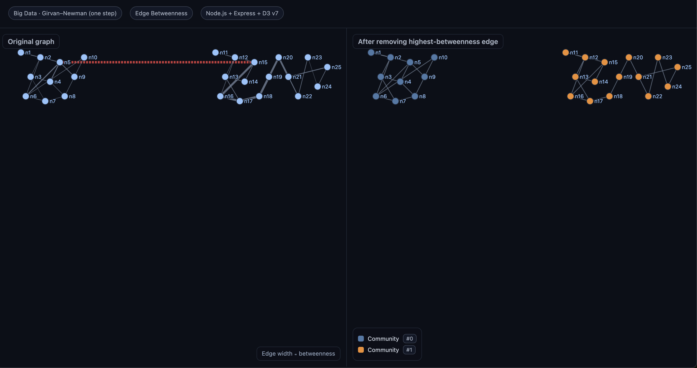

# Big Data Assignment — Girvan–Newman (Node.js)

This project implements **Part A–C** for the assignment:

- **Part A:** Create an undirected graph from a `samplenetwork.txt` file.
- **Part B:** Implement the **Girvan–Newman** algorithm step to:
  1) Compute **edge betweenness centrality** (Brandes algorithm for edges), and
  2) Remove the **single** highest-betweenness edge.
- **Part C:** Visualize the **original** vs **after community detection** (one step) on an HTML page using **D3.js**.

---

## Project Structure

```
bigdata-gn-node/
├─ data/
│  └─ samplenetwork.txt       # 20 nodes, 28 edges (two dense clusters + a bridge)
├─ public/
│  └─ index.html              # D3 visualization (original vs after)
├─ src/
│  ├─ graph.js                # Graph structure, edge betweenness, components
│  └─ parser.js               # Parser for the txt format
├─ server.js                  # Express server (API + static files)
├─ package.json
└─ README.md
```

---

## How to Run

1. **Install dependencies** (Node 18+ recommended):
   ```bash
   npm install
   ```

2. **Start the server**:
   ```bash
   npm start
   ```

3. Open your browser to **http://localhost:3000**

> If you edit `data/samplenetwork.txt`, you can hit `http://localhost:3000/api/reload` to rebuild the graphs without restarting.

## Screenshot


*Left: Original graph with edge betweenness visualization. Right: Graph after community detection with nodes colored by community.*

---

## Input Format (`samplenetwork.txt`)

Nodes and edges are defined as:

```
n1 [x1,y1]
n2 [x2,y2]
...
edge(n1,n3)
edge(n3,n2)
```

- Lines starting with `%` are treated as comments.
- Coordinates are **optional**; if omitted, D3's force layout will place nodes.
- Unknown lines (e.g. `5mm`) are ignored.

---

## What’s Implemented

### Part A — Create the Network

- `src/parser.js` reads `data/samplenetwork.txt`, recognizing node lines with or without coordinates and `edge(u,v)` lines.
- `src/graph.js` builds an **undirected** adjacency structure (`Map<nodeId, Set<neighborId>>`).

### Part B — Girvan–Newman (one step)

We compute **edge betweenness centrality** using the **Brandes algorithm** for **undirected** graphs:

1. For each source node `s`, run **single-source shortest paths** with BFS to compute:
   - `sigma[v]`: number of shortest paths from `s` to `v`,
   - `P[w]`: predecessors of `w` on shortest paths,
   - `dist[v]`: breadth-first distances.
2. **Accumulate** dependencies (`delta`) from farthest to closest nodes to compute edge contributions.
3. Sum edge contributions across all sources and **divide by 2** (each undirected path is counted twice).

Then we **choose the single edge** with the maximum betweenness and **remove** it from a clone of the original graph.

> If there’s a tie for maximum betweenness, we remove the first encountered max edge (deterministic by iteration order).

Finally, we compute **connected components** on the modified graph to label **communities**.

### Part C — Visualization

- The Express server provides `/api/graphs` returning:
  - **original**: nodes + links + `betweenness` map, and which edge was removed;
  - **after**: nodes + links colored by **community ID**.
- `public/index.html` renders two side-by-side **force-directed** layouts using **D3 v7**:
  - **Left**: Original graph; **edge width ∝ betweenness** and the removed edge is highlighted.
  - **Right**: After removing the highest-betweenness edge; **nodes are colored by community**.

---

## Changing the Graph

Edit `data/samplenetwork.txt`. Example is already provided with **25 nodes** and **34 edges** forming **two large clusters** connected by a single **bridge** (which GN will remove). If you want more nodes or edges, just add them; the parser is flexible.

---

## Why Girvan–Newman & Edge Betweenness?

- **Edge betweenness** counts how often an edge lies on **shortest paths** between pairs of nodes.
- Edges that **bridge** communities tend to have **high betweenness** because many shortest paths traverse them.
- By iteratively removing such edges, **Girvan–Newman** reveals community structure.

This project performs **one step** (remove the single highest-betweenness edge), which is exactly what the assignment asks.

---

## Notes

- Self-loops are ignored; parallel edges are merged (simple graph).
- For reproducibility, we use a deterministic key `u|v` with sorted endpoints for each undirected edge.
- The layouts are **interactive**: drag nodes to explore the structure.
